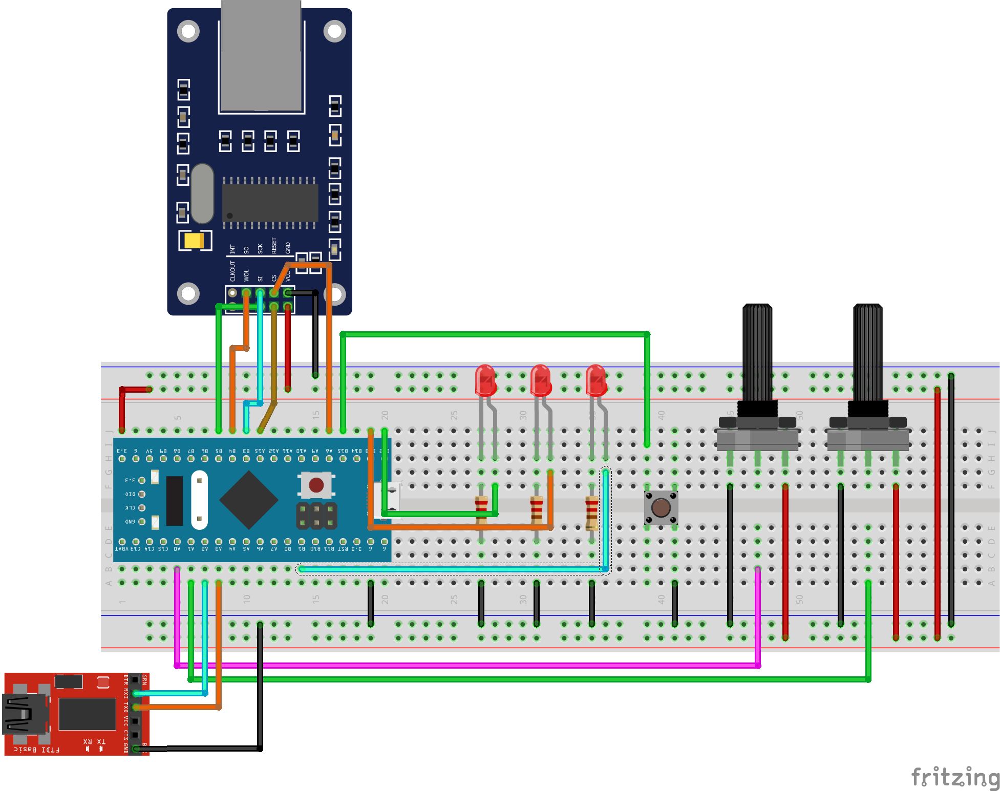

# STM32 TCP Server (MBED)

### In this project, there is an ENC28j60 module used with a STM32F103C8T6 microcontroller to create a TCP sever. The TCP server can work with multiple clients which made from C#. You can access project description from <a href="http://www.elektrobot.net/stm32-ve-enc28j60-ile-tcp-server-uygulamasi-mbed/">this link</a>

### Connection diagram of this project exist in below

