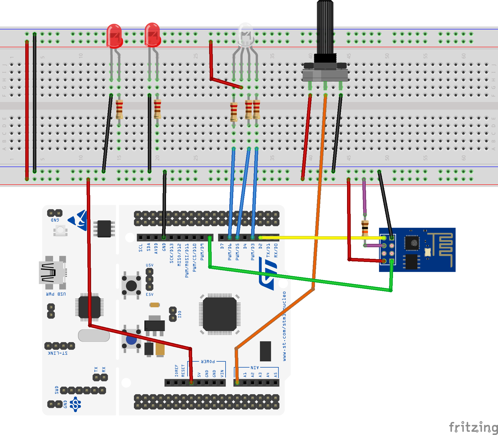

# MQTT Communication Between STM32 and Processing Using ESP8266

In this project we used Mbed OS to develop STM32 software. Mbed makes easy to connect ESP8266 and prepare MQTT messages. 

main.cpp      ==> Main software file for STM32 software
mbed_app.json ==> Settings file which needs Mbed to determine wifi module, connection pins and wifi credentials
mqttgui       ==> Includes processing software which creates control GUI

### Connection diagram for STM32 shown in picture

### Processing gui for control RGB and normal leds and show potantiometer value in graph

In this link you can reach all information about with this project from [this link](http://www.elektrobot.net/stm32-ile-esp8266-kullanarak-mqtt-client-mbed/)