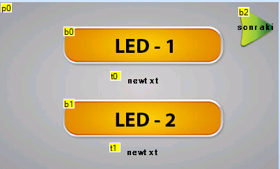
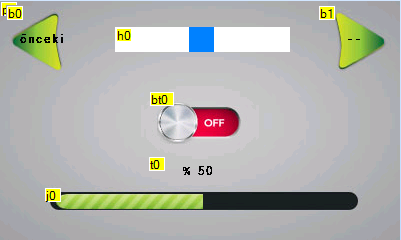

## STM32 Mbed Example with using Nextion screen

In this example we used a Nextion Screen to control IO which is in STM32F767 Board. You can design your interface with Photoshop editor. And import designed images to Nexiton editor. 

### Source code is under /src folder.

You can see my designs pages below.

